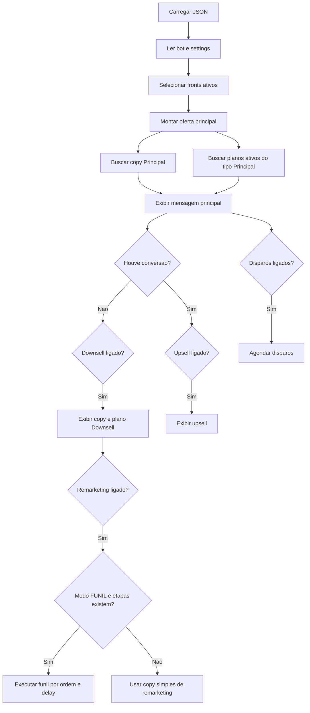

# Guia de Leitura dos Configs dos Bots

## O que são estes arquivos

Os dois arquivos JSON deste workspace são exports de configuração no formato `flexion-normal-export`.

Eles não são o código do bot. Eles são a base de dados de configuração que um sistema externo usa para montar:

- identidade do bot
- flags de funcionamento
- rastreamento
- funil principal
- ofertas
- copies
- mídias
- sequências automáticas

Os arquivos existentes são:

| Arquivo | Bot | Papel principal | Leitura prática |
| --- | --- | --- | --- |
| `config_jenniivip_bot.json` | `jenniivip_bot` | Bot de venda de VIP/conteúdo pago | Funil comercial completo, com principal, downsell, upsell, disparos e remarketing |
| `config_taxadebloqueiioo_bot.json` | `taxadebloqueiioo_bot` | Bot de tarifa/liberação de acesso | Funil focado em taxa de segurança/desbloqueio de acesso |

## Estrutura comum dos dois arquivos

Os dois seguem a mesma árvore principal:

| Caminho | O que representa |
| --- | --- |
| `meta` | Dados do export: formato, versão e data de geração |
| `bot` | Identidade do bot: id, `@arroba` e modo geral |
| `settings` | Flags globais de comportamento |
| `feedbacks` | Bloco de feedbacks prontos para exibir ou usar no funil |
| `pixels` | Configuração de tracking, pixels e scripts relacionados |
| `fronts` | Lista de frentes/funis do bot |
| `fronts[].planos` | Catálogo de ofertas daquele front |
| `fronts[].copies` | Mensagens prontas por tipo de etapa |
| `fronts[].funis` | Sequências automáticas com atraso e ordem |
| `fronts[].order_bump` | Oferta adicional opcional |

## Como ler os arquivos mais facilmente

Se a ideia é entender rápido e depois copiar para código, leia nesta ordem:

1. `bot`
2. `fronts[0]`
3. flags `*_estado`
4. `planos` filtrando por `ativo: true`
5. `copies` por `tipo`
6. `funis`
7. `order_bump`

Na prática, a leitura mais útil é esta:

### 1. Identifique qual bot é

Olhe primeiro para:

```json
"bot": {
  "bot_id": 4560,
  "arroba": "jenniivip_bot",
  "modo": "NORMAL"
}
```

ou:

```json
"bot": {
  "bot_id": 4561,
  "arroba": "taxadebloqueiioo_bot",
  "modo": "NORMAL"
}
```

Isso responde: de qual bot este export veio.

### 2. Descubra se o front está ligado

O primeiro filtro real é:

```json
"fronts": [
  {
    "nome": "Principal",
    "ativo": true
  }
]
```

Se `ativo` estiver `false`, aquele front inteiro deve ser tratado como desligado.

### 3. Descubra quais etapas do funil estão ligadas

Dentro de cada front existem várias flags:

- `downsell_estado`
- `upsell_estado`
- `disparos_estado`
- `remarketing_estado`
- `banimento_estado`
- `order_bump_estado`

Exemplo prático:

- No `config_jenniivip_bot.json`, `upsell_estado` e `remarketing_estado` estão ligados.
- No `config_taxadebloqueiioo_bot.json`, `upsell_estado` e `remarketing_estado` estão desligados.

Isso é importante porque um plano ativo sozinho nao significa que a etapa esta funcionando. O que manda no fluxo e a combinacao entre:

- front ativo
- estado da etapa em `on`
- existencia de copy daquele tipo
- existencia de plano ativo daquele tipo
- em funil sequencial, existencia de itens em `funis`

## Regra prática para saber se algo realmente roda

Use esta lógica mental:

```ts
const etapaAtiva =
  front.ativo === true &&
  estadoDaEtapa === 'on' &&
  existeCopyDoTipo &&
  existePlanoAtivoDoTipo;
```

Para remarketing em modo de funil:

```ts
const remarketingEmFunil =
  front.ativo === true &&
  front.remarketing_estado === 'on' &&
  front.remarketing_modo === 'FUNIL' &&
  front.funis.remarketing.length > 0;
```

## O que cada arquivo é, na prática

## `config_jenniivip_bot.json`

Este arquivo representa um bot de venda direta de acesso VIP.

Sinais claros disso:

- copy principal oferece planos VIP
- existe upsell de chamada de video
- existe downsell
- existe disparo promocional
- existe remarketing com varias etapas e descontos
- ha muitos planos do tipo `mailing`, varios apontando para outro bot/link de entrega

Resumo funcional:

- objetivo principal: vender acesso VIP
- funil: mais completo
- tema das copies: venda, desconto, oferta, urgencia, chamada
- automacao: forte uso de remarketing em sequencia

Pontos importantes desse arquivo:

- `upsell_estado` esta `on`
- `remarketing_estado` esta `on`
- `remarketing_modo` esta `FUNIL`
- `funis.remarketing` tem 4 etapas configuradas
- existem muitos `planos` ativos do tipo `mailing`

Leitura de negocio:

- `Principal`: apresenta os planos principais do VIP
- `Downsell`: tenta recuperar quem nao converteu
- `Upsell`: tenta vender uma oferta adicional depois
- `Disparos`: oferta promocional recorrente
- `Remarketing`: sequencia com atrasos e descontos

## `config_taxadebloqueiioo_bot.json`

Este arquivo representa um bot de taxa/liberacao de acesso.

Sinais claros disso:

- a copy principal fala em `Tarifa de Segurança`
- o texto explica verificacao obrigatoria e valor reembolsavel
- ha ofertas chamadas `TARIFA/REEMBOLSAVEL` e `LIBERAR ACESSO`
- o tema nao e VIP adulto como principal, e sim desbloqueio/acesso

Resumo funcional:

- objetivo principal: cobrar uma taxa para liberar acesso
- funil: mais simples
- tema das copies: seguranca, verificacao, desbloqueio
- automacao: pouca ou nenhuma sequencia detalhada

Pontos importantes desse arquivo:

- `downsell_estado` esta `on`
- `disparos_estado` esta `on`
- `upsell_estado` esta `off`
- `remarketing_estado` esta `off`
- `funis.remarketing` esta vazio

Observacao importante:

Esse arquivo tem planos ativos de tipos como `Upsell` e `Remarketing`, mas as flags do front deixam essas etapas desligadas. Ou seja: os dados existem, mas o fluxo aparente nao deveria usar essas etapas enquanto os estados estiverem `off`.

## Diferencas objetivas entre os dois

| Aspecto | `config_jenniivip_bot.json` | `config_taxadebloqueiioo_bot.json` |
| --- | --- | --- |
| Bot | `jenniivip_bot` | `taxadebloqueiioo_bot` |
| Tema principal | Venda de VIP | Taxa de seguranca/desbloqueio |
| Upsell | Ligado | Desligado |
| Remarketing | Ligado | Desligado |
| Modo do remarketing | `FUNIL` | `NORMAL` |
| Etapas em `funis.remarketing` | 4 etapas | 0 etapas |
| Copy principal | Oferta de planos VIP | Tarifa de seguranca reembolsavel |
| Complexidade do funil | Alta | Media/baixa |

## Campos mais importantes para copiar para o código

Se voce quiser transformar esses JSONs em objetos internos do sistema, estes sao os campos mais relevantes:

| Campo | Uso sugerido no código |
| --- | --- |
| `bot.arroba` | Identificador humano do bot |
| `bot.bot_id` | Identificador numerico |
| `settings.tracking_nativo` | Habilitar tracking interno |
| `pixels[]` | Tracking externo e pixel |
| `fronts[].ativo` | Liga/desliga o front |
| `fronts[].*_estado` | Liga/desliga cada etapa do funil |
| `fronts[].*_modo` | Define como a etapa opera |
| `fronts[].planos[]` | Catalogo de ofertas |
| `fronts[].copies[]` | Templates de mensagem por etapa |
| `fronts[].funis.*[]` | Sequencia automatica com atraso |
| `fronts[].order_bump` | Oferta adicional depois da compra |

## Como mapear `planos`

Cada item de `planos` funciona como uma oferta configuravel.

Campos relevantes:

| Campo | Significado prático |
| --- | --- |
| `export_id` | ID unico do plano dentro do export |
| `nome` | Nome exibido da oferta |
| `valor` | Preco |
| `tipo` | Em que etapa esse plano entra |
| `duracao_dias` | Duracao numerica configurada |
| `entregavel_alt` | Link ou destino alternativo de entrega |
| `ativo` | Se o plano pode ser usado |
| `ordem` | Prioridade/ordenacao |
| `modo` | Modo do plano, como `NORMAL` ou `mailing:x:y` |
| `cor_plano` | Variacao visual |

Os tipos que aparecem com mais frequencia sao:

- `Principal`
- `Downsell`
- `Upsell`
- `Disparos`
- `Remarketing`
- `mailing`
- `X1`

Leitura pratica do `tipo`:

- `Principal`: oferta principal mostrada no front
- `Downsell`: oferta de recuperacao
- `Upsell`: oferta adicional
- `Disparos`: oferta usada em disparo
- `Remarketing`: oferta usada em reengajamento
- `mailing`: oferta ligada a campanha ou rota especifica

## Como mapear `copies`

`copies` e o bloco que conecta etapa do funil com texto e mídia.

Cada item tem esta cara:

```json
{
  "tipo": "Principal",
  "copy": "texto da mensagem...",
  "midias": [
    {
      "path": "static/uploads/...",
      "ordem": 1
    }
  ]
}
```

Na pratica:

- `tipo` diz para qual etapa a copy serve
- `copy` e o texto da mensagem
- `midias` lista os arquivos associados

Observacao importante:

`midias[].path` parece ser um caminho interno de armazenamento, nao uma URL publica pronta. No código, provavelmente sera preciso resolver esse caminho para um arquivo servivel.

## Como mapear `funis`

`funis` representa sequencias automatizadas.

Exemplo de item de funil:

```json
{
  "ordem": 1,
  "delay_minutos": 5,
  "copy": "mensagem...",
  "midias": [ ... ],
  "planos": [ ... ]
}
```

Campos principais:

- `ordem`: ordem da etapa
- `delay_minutos`: quando disparar
- `copy`: texto daquela etapa
- `midias`: mídia daquela etapa
- `planos`: quais planos vao junto naquela etapa

No `config_jenniivip_bot.json`, isso aparece de forma real no `remarketing`.

No `config_taxadebloqueiioo_bot.json`, esse bloco existe, mas esta vazio.

## Fluxo inferido de funcionamento

Como nao existe o código consumidor no repositório, o fluxo abaixo e inferido pela estrutura dos JSONs.



## Modelo mental para copiar para o código

Se voce quiser reduzir o JSON para um objeto mais facil de consumir, um mapeamento simples seria:

```ts
type EtapaNome = 'Principal' | 'Downsell' | 'Upsell' | 'Disparos' | 'Remarketing';

function extrairFrontPrincipal(config: any) {
  const front = config.fronts.find((item: any) => item.ativo);

  if (!front) {
    return null;
  }

  const planoPorTipo = (tipo: string) =>
    front.planos.filter((plano: any) => plano.ativo && plano.tipo === tipo);

  const copyPorTipo = (tipo: string) =>
    front.copies.find((copy: any) => copy.tipo === tipo) ?? null;

  return {
    bot: {
      id: config.bot.bot_id,
      arroba: config.bot.arroba,
      modo: config.bot.modo,
    },
    settings: config.settings,
    tracking: config.pixels,
    front: {
      nome: front.nome,
      ativo: front.ativo,
      principal: {
        copy: copyPorTipo('Principal'),
        planos: planoPorTipo('Principal'),
      },
      downsell: {
        enabled: front.downsell_estado === 'on',
        delaySegundos: front.downsell_delay_segundos,
        modo: front.downsell_modo,
        copy: copyPorTipo('Downsell'),
        planos: planoPorTipo('Downsell'),
      },
      upsell: {
        enabled: front.upsell_estado === 'on',
        modo: front.upsell_modo,
        copy: copyPorTipo('Upsell'),
        planos: planoPorTipo('Upsell'),
      },
      disparos: {
        enabled: front.disparos_estado === 'on',
        modo: front.disparos_modo,
        intervalo: front.disparos_intervalo,
        copy: copyPorTipo('Disparos'),
        planos: planoPorTipo('Disparos'),
      },
      remarketing: {
        enabled: front.remarketing_estado === 'on',
        modo: front.remarketing_modo,
        delaySegundos: front.remarketing_delay_segundos,
        copy: copyPorTipo('Remarketing'),
        planos: planoPorTipo('Remarketing'),
        funil: front.funis.remarketing,
      },
      mailing: front.planos.filter((plano: any) => plano.ativo && plano.tipo === 'mailing'),
      orderBump: front.order_bump,
    },
  };
}
```

## Coisas que merecem cuidado no código

- `access_token` em `pixels` e dado sensivel. Nao exponha em log, tela ou frontend.
- `duracao_dias` aparece com numeros muito altos em varios planos. Nao assuma que sempre representa uma quantidade realista de dias corridos.
- `modo` aparece em varios niveis e muda de significado conforme o lugar.
- varios planos antigos continuam no arquivo com `ativo: false`. Para a maioria dos casos, filtre os planos ativos antes de montar a regra de negocio.
- em `config_taxadebloqueiioo_bot.json`, existem dados de etapas que nao estao efetivamente ligadas no front. Nao use apenas `planos[].ativo` como verdade absoluta do fluxo.

## Resumo final

Os dois arquivos sao configuracoes do mesmo formato, mas com estrategias diferentes:

- `config_jenniivip_bot.json` e um funil comercial de VIP mais completo e agressivo
- `config_taxadebloqueiioo_bot.json` e um funil de taxa/liberacao, mais focado em desbloqueio de acesso

Se voce for copiar isso para código, pense nesses arquivos como:

- um objeto de identidade do bot
- um bloco global de settings
- um ou mais fronts
- dentro de cada front, etapas do funil controladas por flags
- dentro de cada etapa, planos, copy, mídia e automação